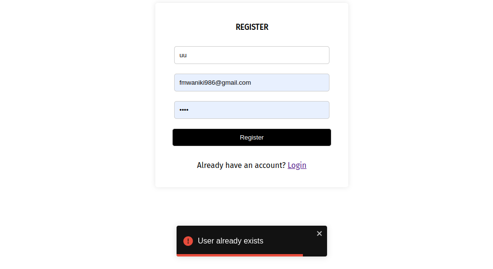
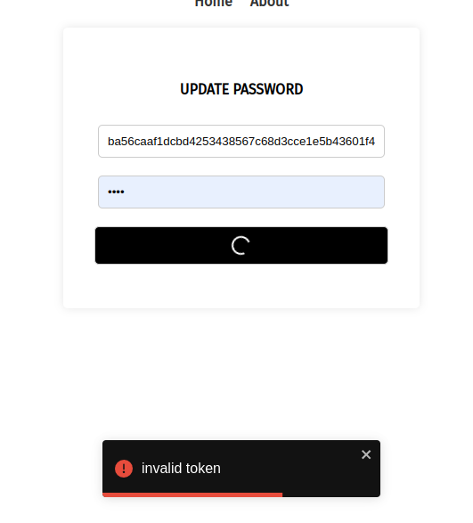

### usage
```bash
$ git clone git@github.com:Francis-Mwaniki/flask-vue-auth.git
```
### run frontend
```bash
 $ cd flask-vue-auth/fronted && npm install
    $ npm run serve
```
### run backend
```bash
$ cd flask-vue-auth/server
$ python3 -m venv venv
$ source venv/bin/activate
$ pip install -r requirements.txt
$ python run.py
```




